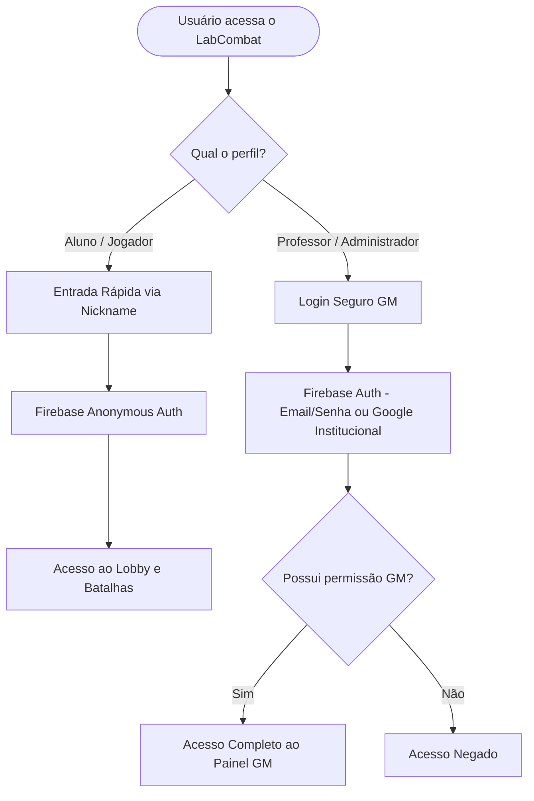

# 📋 Plano de Implementação, Arquitetura e Produção - LabCombat

Este documento detalha o planejamento técnico completo para a evolução do **LabCombat**, cobrindo novas funcionalidades de gameplay, ferramentas pedagógicas, infraestrutura para disponibilizar o jogo online publicamente, estratégia de autenticação e diretrizes de conformidade com a **LGPD (Lei Geral de Proteção de Dados)**.

---

## 📌 Sumário
1. [Fase 1: Gameplay, Áudio e Resiliência Multiplayer](#-fase-1-gameplay-áudio-e-resiliência-multiplayer)
2. [Fase 2: Gestão Pedagógica e Painel do Game Master](#-fase-2-gestão-pedagógica-e-painel-do-game-master)
3. [Fase 3: Infraestrutura e Publicação Online (Deploy)](#-fase-3-infraestrutura-e-publicação-online-deploy)
4. [Fase 4: Autenticação e Segurança de Dados](#-fase-4-autenticação-e-segurança-de-dados)
5. [Fase 5: Conformidade com a LGPD](#-fase-5-conformidade-com-a-lgpd-lei-137092018)
6. [Fase 6: Licenciamento de Software e Propriedade Intelectual](#-fase-6-licenciamento-de-software-e-propriedade-intelectual)
7. [Matriz de Priorização e Cronograma Sugerido](#-matriz-de-priorização-e-cronograma-sugerido)

---

## 🎮 Fase 1: Gameplay, Áudio e Resiliência Multiplayer

### 1.1 Tratamento de Desconexão em Batalha (Vitória por W.O.)
* **Problema:** Se um jogador fechar o navegador no meio da partida (`MainScene`), o adversário fica esperando até o temporizador forçar timeout rodada a rodada.
* **Como implementar:**
  1. Registrar na entrada do `MainScene` o gatilho `onDisconnect(ref(db, `rooms/${roomId}/${playerId}`)).remove()`.
  2. No listener `onValue` do `MainScene`, monitorar a existência do nó do oponente (`data.p1` e `data.p2`).
  3. Se o oponente for removido com a partida em andamento (`!data[oppKey] && !this.isGameOver`), disparar o método `handleOpponentDisconnect()`:
     * Pausar temporizadores de rodada.
     * Exibir modal central: `⚠️ O oponente abandonou o duelo! Vitória por W.O.`.
     * Atribuir vitória ao jogador remanescente e oferecer botões `[Voltar ao Menu]` ou `[Aguardar Novo Desafiante]`.

### 1.2 Sistema de Efeitos Sonoros Retrô (Web Audio API)
* **Objetivo:** Adicionar imersão arcade sem precisar carregar arquivos de áudio externos pesados (MP3/WAV).
* **Como implementar:**
  * Criar o módulo `src/audio.js` utilizando a **Web Audio API** nativa dos navegadores:
    ```javascript
    // Exemplo de síntese chiptune nativa para acerto, erro e K.O.
    const ctx = new (window.AudioContext || window.webkitAudioContext)();

    export function playHitSound() {
        const osc = ctx.createOscillator();
        const gain = ctx.createGain();
        osc.type = 'square';
        osc.frequency.setValueAtTime(440, ctx.currentTime);
        osc.frequency.exponentialRampToValueAtTime(110, ctx.currentTime + 0.15);
        gain.gain.setValueAtTime(0.3, ctx.currentTime);
        gain.gain.linearRampToValueAtTime(0.01, ctx.currentTime + 0.15);
        osc.connect(gain);
        gain.connect(ctx.destination);
        osc.start();
        osc.stop(ctx.currentTime + 0.15);
    }
    ```
  * **Efeitos mapeados:**
    * 🔔 Contagem regressiva (3, 2, 1, FIGHT!).
    * 💥 Acerto normal (-15 HP).
    * 🛡️ Bloqueio com Firewall ou absorção Try-Catch.
    * ⚡ Ativação de Ultimate Finisher.
    * 💀 K.O. e Fanfarra de Vitória.
  * Adicionar botão flutuante `🔊/🔇` no topo da tela para controle do usuário.

### 1.3 Animações de Ataque e Projéteis Temáticos
* **Como implementar:**
  * Ao confirmar resposta com acerto, aplicar tween de arremetida no sprite do lutador:
    ```javascript
    this.tweens.add({
        targets: attackerSprite,
        x: attackerSprite.x + (isP1 ? 60 : -60),
        duration: 90,
        yoyo: true,
        ease: 'Quad.easeInOut'
    });
    ```
  * Criar projéteis temáticos com partículas ou sprites pequenos viajando entre os dois lados da arena:
    * *Sistemas Operacionais:* Ícone de processo / terminal.
    * *Redes:* Pacote TCP azul / raios de conexão.
    * *Banco de Dados:* Cilindro de tabela SQL / raio roxo.
    * *Web & Mobile:* Tag `</>` ou engrenagem reativa.

### 1.4 Suporte Mobile e Bloqueio de Orientação
* **Problema:** Em telas de smartphone na vertical, a proporção 16:9 corta a interface ou reduz demais a fonte.
* **Como implementar:**
  * Inserir um overlay CSS no `index.html` ativado por media query:
    ```css
    @media screen and (orientation: portrait) and (max-width: 900px) {
        #rotate-device-overlay {
            display: flex !important;
        }
    }
    ```
  * Esse overlay bloqueia as interações e exibe uma animação instruindo o jogador a virar o celular para a posição horizontal (*Landscape*).

---

## 📚 Fase 2: Gestão Pedagógica e Painel do Game Master

### 2.1 Gerenciador de Perguntas no Firebase (CRUD de Questões)
* **Objetivo:** Permitir que o professor adicione, edite ou desative perguntas diretamente pelo navegador sem alterar o código-fonte.
* **Como implementar:**
  * Estruturar o nó `questions/` no Firebase Realtime Database:
    ```json
    {
      "questions": {
        "q_01": {
          "text": "O que faz o comando git status?",
          "options": ["Cria commits", "Exibe estado da working tree", "Deleta branches", "Baixa repositório"],
          "correctIndex": 1,
          "category": "eng_soft",
          "difficulty": "facil"
        }
      }
    }
    ```
  * Adicionar a 4ª aba no Painel GM: **"Gerenciar Questões"** com formulário de cadastro e listagem dinâmica com botão de excluir.
  * O `MainScene.js` carrega primeiro as perguntas do Firebase com fallback local para `src/questions.js` caso esteja offline.

### 2.2 Sorteio de Perguntas por Disciplina Escolhida
* Se a luta for entre o lutador de **Banco de Dados** e o de **Redes**, o algoritmo de sorteio de questões dá prioridade para perguntas dessas duas categorias, tornando o combate temático.

### 2.3 Importação e Exportação de Quizzes (JSON / CSV)
* Botão no painel do professor para importar um arquivo `.json` com até 50 questões prontas para simulados ou provas temáticas em sala de aula.

---

## 🌐 Fase 3: Infraestrutura e Publicação Online (Deploy)

Para que alunos e colegas possam jogar de qualquer lugar (em sala de aula, casa ou celular), o jogo precisa ser publicado em um provedor de hospedagem web com **HTTPS** e baixa latência.

### 3.1 Comparativo de Plataformas Recomendadas

| Provedor | Custo | Integração GitHub | Facilidade | Recomendação |
| :--- | :--- | :--- | :--- | :--- |
| **Vercel** | Gratuito | Automática (Deploy a cada git push) | Alta (Zero Configuração para Vite) | ⭐ **Principal Recomendação** |
| **Firebase Hosting** | Gratuito (Spark) | Via GitHub Actions ou CLI | Média (Mesmo ecossistema do RTDB) | ⭐ **Excelente alternativa** |
| **Netlify** | Gratuito | Automática | Alta | Boa alternativa |
| **GitHub Pages** | Gratuito | Via GitHub Actions | Média | Viável, porém requer ajuste de base path |

---

### 3.2 Passo a Passo para Deploy na Vercel (Recomendado)
A Vercel reconhece projetos Vite instantaneamente e gera um link público seguro com SSL (ex: `https://labcombat.vercel.app`):

1. Acesse [vercel.com](https://vercel.com/) e faça login com sua conta do **GitHub**.
2. Clique em **"Add New..."** ➔ **"Project"**.
3. Selecione o repositório `GGnzr/labcombat`.
4. A Vercel detectará automaticamente o framework como **Vite**:
   * **Build Command:** `npm run build`
   * **Output Directory:** `dist`
5. Clique em **"Deploy"**.
6. Em menos de 1 minuto, o link público seguro estará online! Qualquer novo `git push main` atualizará o jogo automaticamente.

---

### 3.3 Capacidade e Limites do Firebase Realtime Database (Plano Gratuito Spark)
O Firebase oferece um plano gratuito generoso para ambientes educacionais:
* **Conexões simultâneas:** Até **100 usuários simultâneos** conectados ao mesmo tempo (o equivalente a 50 partidas 1v1 simultâneas).
* **Armazenamento de dados:** 1 GB (suficiente para milhares de salas e perguntas, já que cada sala ocupa menos de 2 KB).
* **Download de dados:** 10 GB/mês.
* **Boas práticas de economia de cota:**
  * Uso contínuo de `onDisconnect().remove()` para que salas antigas não fiquem ocupando espaço.
  * A rotina de limpeza de salas vazias já implementada no Painel GM garante o consumo mínimo da cota.

---

## 🔐 Fase 4: Autenticação e Segurança de Dados

Atualmente, o jogo utiliza PIN mestre local no código para o painel de desenvolvimento e apelidos livres para os jogadores. Para um ambiente de produção seguro, propõe-se a seguinte arquitetura:



### 4.1 Estratégia de Autenticação Híbrida

1. **Alunos / Jogadores (Acesso Sem Atrito):**
   * Em contexto escolar/universitário, exigir cadastro com e-mail e senha causa desistência e perda de tempo da aula.
   * **Solução:** **Firebase Anonymous Authentication** combinado com o **Nickname** escolhido. O Firebase gera um identificador único de sessão (UID) seguro por baixo dos panos, sem exigir dados pessoais do aluno.

2. **Professores / Administradores (Game Master):**
   * Migrar do PIN hardcoded (`admin`) para **Firebase Authentication** com E-mail e Senha exclusivos do professor (ou login Google institucional).
   * O painel GM só renderiza os controles após validação do token JWT do Firebase, impedindo que alunos abram a sidebar inspecionando o código via DevTools (`F12`).

### 4.2 Regras de Segurança do Firebase (`database.rules.json`)
Para evitar que alunos trapaceiem editando o HP ou carga de especial diretamente pelo console do navegador, as regras de segurança do Realtime Database devem ser configuradas no console do Firebase:

```json
{
  "rules": {
    "rooms": {
      ".read": true,
      "$roomId": {
        ".write": "auth != null",
        "p1": {
          ".write": "auth != null"
        },
        "p2": {
          ".write": "auth != null"
        }
      }
    },
    "questions": {
      ".read": true,
      ".write": "auth != null && auth.token.email === 'professor@instituicao.edu.br'"
    }
  }
}
```

---

## 🛡️ Fase 5: Conformidade com a LGPD (Lei 13.709/2018)

A **LGPD** estabelece regras rígidas para a coleta, tratamento e armazenamento de dados pessoais no Brasil, especialmente no ambiente educacional. O LabCombat adota o conceito de **Privacy by Design (Privacidade desde a Concepção)**:

### 5.1 Princípio da Minimização de Dados (Art. 6º, III)
* **O que o LabCombat coleta:** Apenas um **Apelido temporário (Nickname)** e métricas do jogo (HP, tempo de resposta, acertos).
* **O que o LabCombat NÃO coleta:** Nome civil completo, CPF, e-mail de alunos, foto pessoal, localização geográfica, endereço IP persistente, cookies de rastreamento publicitário.
* **Vantagem Jurídica:** Por não coletar dados pessoais identificáveis de estudantes, o jogo não cria passivos de vazamento de dados e dispensa burocracias pesadas de consentimento parental (Art. 14 da LGPD sobre crianças e adolescentes).

### 5.2 Ciclo de Vida e Retenção Efêmera dos Dados (Art. 16)
* Os dados das partidas pertencem à categoria de **dados voláteis (efêmeros)**.
* Ao finalizar a partida ou fechar a aba do navegador:
  * A sala e os nós de jogador são deletados via `onDisconnect`.
  * Nenhum log com dados de navegação é vendido ou compartilhado com terceiros.
  * O `localStorage` armazena apenas preferências de interface do próprio dispositivo (ex: volume mudo, último apelido usado).

### 5.3 Termos de Uso e Aviso de Privacidade
Incluir um link discreto no rodapé do menu principal com um modal de transparência contendo o seguinte texto:

> **🔒 Aviso de Privacidade e Termos de Uso:**
> *"O LabCombat é uma ferramenta exclusivamente educacional. Não coletamos dados pessoais sensíveis, documentos ou e-mails de estudantes. Os apelidos inseridos são públicos dentro da sala da partida e descartados ao término da sessão. Ao utilizar este jogo, você concorda com o uso de cookies estritamente técnicos para a sincronização da partida em tempo real."*

---

## ⚖️ Fase 6: Licenciamento de Software e Propriedade Intelectual

Quando um projeto é publicado no GitHub sem uma licença explícita, a legislação internacional de direitos autorais considera que ele está sob *"Todos os Direitos Reservados"*. Isso significa que outras pessoas e instituições de ensino **não têm permissão legal** para clonar, executar em seus servidores, modificar ou contribuir com o projeto.

### 6.1 Comparativo de Licenças de Código Aberto

| Licença | Tipo | Liberdades | Obrigações | Ideal para... |
| :--- | :--- | :--- | :--- | :--- |
| **MIT** | Permissiva | Uso livre, comercial, educacional, modificação e distribuição | Manter o aviso de copyright original | ⭐ **Portfólio, projetos acadêmicos e ecossistema JavaScript/Phaser** |
| **GPLv3** | Copyleft Estrito | Uso livre e modificação | Derivados **devem** ser 100% código aberto sob a mesma licença | Quem não quer que terceiros fechem o código ou vendam sem abrir |
| **Apache 2.0** | Permissiva | Semelhante à MIT | Exige menção de alterações e concessão de patentes | Grandes ecossistemas corporativos |
| **CC BY-NC 4.0** | Conteúdo Criativo | Uso livre educacional e não comercial | Proíbe monetização/venda comercial das artes e mídias | Sprites, ilustrações, banco de questões e efeitos sonoros |

---

### 6.2 Qual Licença Aplicar no LabCombat? (Recomendação)

Recomendamos a estratégia de **Licenciamento Misto (Padrão da Indústria de Games)**:

1. **Para o Código-Fonte (Engine, Lógica, Cenas, Scripts):**
   * **Licença MIT**: É a mesma licença do **Phaser 3** e do **Vite**. É simples, universalmente reconhecida por recrutadores no GitHub e dá total segurança para professores e alunos usarem e estudarem o código sem receios jurídicos.
   * **Isenção de Responsabilidade:** A licença MIT contém cláusula expressa de que o software é fornecido *"NO ESTADO EM QUE SE ENCONTRA"* (*AS IS*), isentando os autores de responsabilidades por eventuais bugs ou indisponibilidade de serviços terceiros (como Firebase).

2. **Para os Assets Visuais e Conteúdo Educacional (Personagens, Sprites, Questões):**
   * Manter declaração de direitos morais autorais no README: o código é aberto (MIT), porém as artes visuais e os personagens são de autoria do projeto e voltados para **fins estritamente educacionais e não-comerciais**.

---

## 📊 Matriz de Priorização e Cronograma Sugerido

```
                 ALTO IMPACTO
                      │
   [1.1 Desconexão W.O.]    │    [3.2 Deploy Vercel Online]
   [1.2 Áudio/SFX Arcade]   │    [4.2 Regras Segurança Firebase]
   [1.4 Rotação Mobile]     │    [2.1 CRUD Perguntas GM]
                      │
 BAIXO ESFORÇO ───────┼─────── ALTO ESFORÇO
                      │
   [5.3 Aviso LGPD no Menu] │    [4.1 Login Institucional Google]
   [1.3 Projéteis e Tweens] │    [2.3 Importador JSON/Excel]
                      │
                 BAIXO IMPACTO
```

### Roteiro de Execução Recomendado:

1. **Sprint 1 (Deploy Online & Estabilidade):**
   * Publicar na Vercel para permitir testes reais com alunos online.
   * Implementar o tratamento de desconexão e W.O. na batalha (`MainScene.js`).
   * Adicionar aviso de rotação de tela para celular.
2. **Sprint 2 (Imersão & Feedback de Combate):**
   * Adicionar módulo de som com Web Audio API (`src/audio.js`).
   * Animações de arremetida e projéteis dos personagens.
   * Aviso de privacidade (LGPD) no rodapé.
3. **Sprint 3 (Expansão Pedagógica & Segurança):**
   * CRUD de perguntas no Painel GM sincronizado com o Firebase.
   * Autenticação real para o Game Master e regras de segurança no Firebase.

---
*Documento elaborado para a evolução do LabCombat (2026).*
